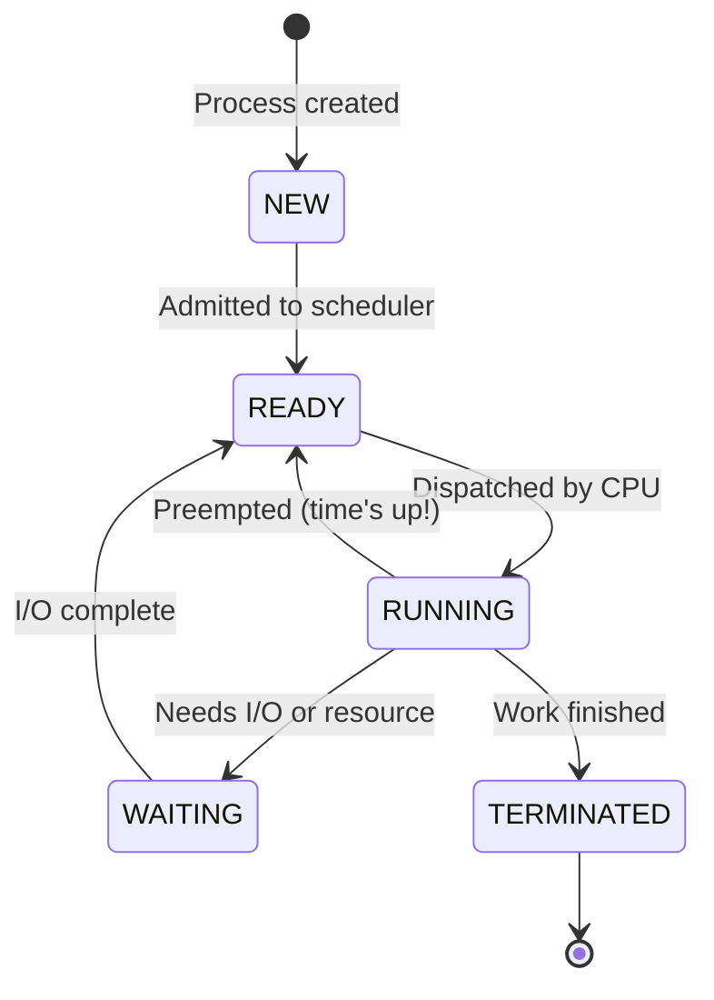
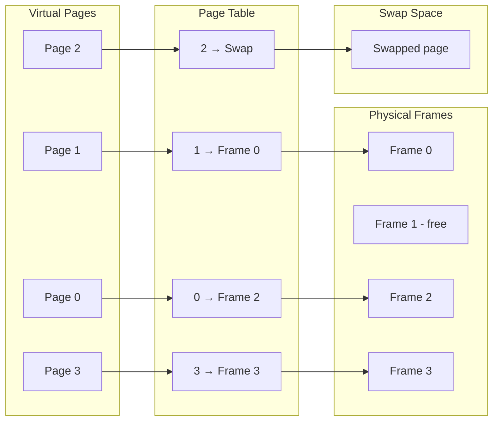

# Visual Guide

Pictures are worth a thousand words. These diagrams show how the key parts of an operating system work, using the same concepts you'll find inside PyOS.

## Process States: The Five Lives of a Program

Think of a process like a student in a school. When they first arrive, they're **new**. Once they sit down and the teacher knows about them, they're **ready** to answer questions. When the teacher calls on them, they're **running** -- actively doing work. Sometimes they have to **wait** (like waiting for a book from the library). And eventually they finish their work and are **terminated**.

**What's happening here?**

- **NEW** -- The process was just created. It doesn't have a seat yet.
- **READY** -- The process is in the ready queue, waiting its turn for the CPU.
- **RUNNING** -- The process is actively executing on the CPU. Only one process per CPU can be here at a time.
- **WAITING** -- The process asked for something slow (like reading a file) and is parked until that finishes.
- **TERMINATED** -- The process is done. Its memory and resources are cleaned up.
- The arrows show every possible transition. Notice that a process can bounce between READY and RUNNING many times before it finally finishes.

## Memory: From Virtual Pages to Physical Frames

Imagine your desk can only hold 4 books at a time (physical frames), but you have 8 chapters of notes (virtual pages). The page table is like a sticky note on each chapter telling you which desk slot it's in right now -- or that it's stored in your backpack (swap).

**What's happening here?**

- Each process thinks it has its own private memory (virtual pages).
- The **page table** translates virtual page numbers to physical frame numbers.
- Not every page needs to be in physical memory at once. Page 2 has been **swapped** to disk because we ran out of room.
- Frame 1 is **free** -- available for the next page that needs to be loaded.
- When the process accesses Page 2, a **page fault** occurs: the OS loads it from swap into a free frame and updates the page table.
